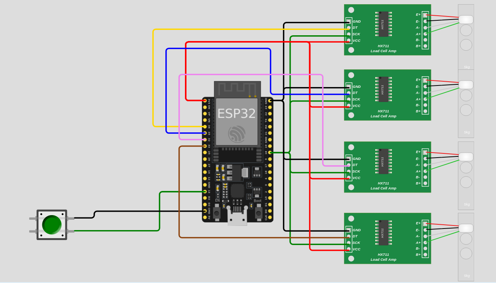
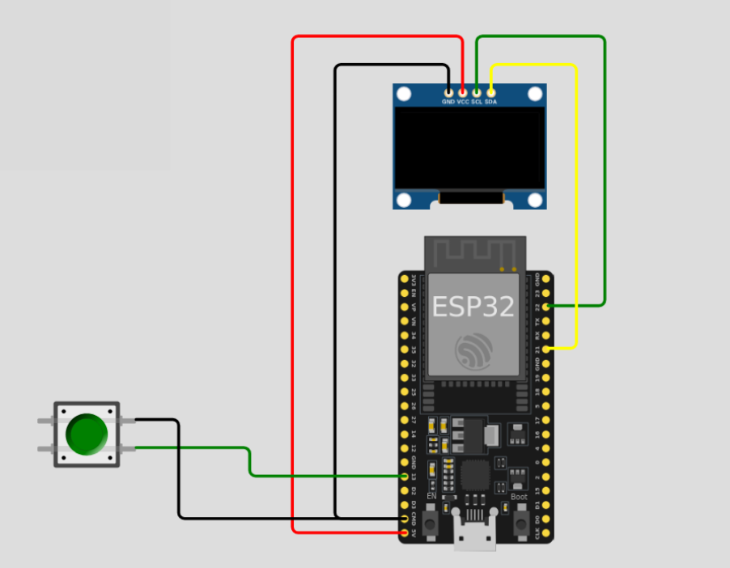

# Tutoriel ESP32 - Mesure de forces par Bluetooth

Ce tutoriel explique le fonctionnement de la lecture des capteurs jusqu'a l'affichage et l'enregistrement.
Système complet de mesure et d'affichage de forces utilisant deux ESP32 communiquant via Bluetooth.

##  Description du projet

Ce projet permet de **mesurer 4 forces en temps réel** à l'aide de capteurs HX711, de les **transmettre sans fil via Bluetooth** à un second ESP32 qui les **affiche sur un écran OLED**, et d'**enregistrer les données sur ordinateur** au format CSV.

### Architecture du système

```
[4x Capteurs HX711] → [ESP32 Maître] --Bluetooth--> [ESP32 Esclave] → [Écran OLED]
                  ↓
                  [USB/Série]
                  ↓
                [Ordinateur] → [Fichiers CSV]
```

##  Structure du projet

```
Code_ESP32/
├── README.md                        #  Ce fichier
│
├── ESP32_BT_Emetteur/              #  ESP32 MAÎTRE (émetteur)
│   ├── README.md                    #    Documentation du maître
│   └── ESP32_BT_Emetteur.ino       #    Code Arduino pour lecture HX711 + Bluetooth TX
│
├── ESP32_BT_Recepteur_MAC/         #  ESP32 ESCLAVE (récepteur)
│   ├── README.md                    #    Documentation de l'esclave
│   └── ESP32_BT_Recepteur_MAC.ino  #    Code Arduino pour affichage OLED + Bluetooth RX
│
└── Enregistrement_CSV/             #  Enregistrement des données
    ├── README_APPLICATION.md        #    Guide d'utilisation
    ├── enregistrement_serial.py     #    Script Python d'enregistrement
    ├── requirements.txt             #    Dépendances Python
    ├── lecture_USB_ESP32_mac.command     #  Lanceur macOS
    ├── lecture_USB_ESP32_linux.sh        #  Lanceur Linux
    ├── lecture_USB_ESP32_windows.bat     #  Lanceur Windows
    └── donnees_csv/                 #     Dossier des fichiers CSV enregistrés
```

##  Démarrage rapide

### Étape 1 : Préparer le matériel

**ESP32 Maître (Émetteur)** :
- Connecter 4 capteurs HX711 :
  - HX711_1 → GPIO 34
  - HX711_2 → GPIO 35
  - HX711_3 → GPIO 32
  - HX711_4 → GPIO 33
  - CLK (horloge) → GPIO 18
- Bouton de tare → GPIO 13
- Batterie exterieure pour la recharge

**ESP32 Esclave (Récepteur)** :
- Écran OLED :
  - SDA → GPIO 21
  - SCL → GPIO 22
- Bouton pause affichage → GPIO 13
- Connexion USB

Schemas :



### Étape 2 : Flasher les ESP32

1. **Installer Arduino IDE** avec support ESP32

2. **Installer les bibliothèques** :
   - `BluetoothSerial` (inclus avec ESP32)
   - `HX711` (par Bogdan Necula)
   - `Adafruit GFX Library`
   - `Adafruit SSD1306`

3. **Flasher l'ESP32 Esclave d'abord** :
   - Ouvrir `ESP32_BT_Recepteur_MAC/ESP32_BT_Recepteur_MAC.ino`
   - Téléverser vers l'ESP32 esclave
   - Ouvrir le Moniteur Série (115200 bauds)
   - **Noter l'adresse MAC Bluetooth** affichée (ex: `8C:4F:00:63:4A:F6`)

4. **Flasher l'ESP32 Maître** :
   - Ouvrir `ESP32_BT_Emetteur/ESP32_BT_Emetteur.ino`
   - **Modifier ligne 28** : remplacer l'adresse MAC par celle de votre esclave :
     ```cpp
     uint8_t slaveMAC[] = {0x8C, 0x4F, 0x00, 0x63, 0x4A, 0xF6};
     ```
   - Téléverser vers l'ESP32 maître

### Étape 3 : Utiliser le système

1. **Allumer l'ESP32 esclave** (récepteur) en premier
2. **Allumer l'ESP32 maître** (émetteur) en deuxiéme
3. La connexion Bluetooth s'établit automatiquement
4. Les 4 forces s'affichent en temps réel sur l'écran OLED
5. Pour enregistrer les données : voir section suivante

### Étape 4 : Enregistrer les données (optionnel)

1. **Installer Python 3** et les dépendances :
   ```bash
   cd Enregistrement_CSV/
   pip install -r requirements.txt
   ```

2. **Lancer l'enregistrement** :
   - **macOS** : double-cliquer sur `lecture_USB_ESP32_mac.command`
   - **Linux** : double-cliquer sur `lecture_USB_ESP32_linux.sh`
   - **Windows** : double-cliquer sur `lecture_USB_ESP32_windows.bat`

3. Les données sont enregistrées dans `Enregistrement_CSV/donnees_csv/`

## 🔧 Fonctionnalités détaillées

### ESP32 Maître (Émetteur)

 **Mesure des forces** :
- Lecture de 4 capteurs HX711 simultanément
- Conversion automatique en Newtons (N)
- Tare automatique au démarrage
- Bouton de tare manuel pendant l'utilisation

 **Communication** :
- Mode Bluetooth Maître
- Connexion automatique à l'esclave via adresse MAC
- Reconnexion automatique en cas de perte de signal
- Envoi des 4 forces au format tabulé

 **Calibration** :
- Facteurs de calibration configurables (lignes 12-15)
- Affichage sur Moniteur Série pour débogage

### ESP32 Esclave (Récepteur)

 **Affichage OLED** :
- Écran 128x64 pixels
- Affichage en temps réel des 4 forces (C1, C2, C3, C4)
- Indicateur d'état Bluetooth
- Interface claire et lisible

 **Communication** :
- Mode Bluetooth Esclave
- Affichage de l'adresse MAC au démarrage
- Attente de connexion du maître
- Réception et parsing des données

 **Contrôle** :
- Bouton pour mettre en pause/reprendre l'affichage
- Gestion des erreurs de parsing
- Détection de déconnexion

### Enregistrement CSV

 **Acquisition** :
- Détection automatique du port USB de l'ESP32
- Connexion automatique à 115200 bauds
- Lecture en temps réel des données série

 **Enregistrement** :
- Création automatique du dossier `donnees_csv/`
- Nom de fichier avec horodatage : `donnees_forces_YYYYMMDD_HHMMSS.csv`
- Format CSV standard avec en-têtes

 **Compatibilité** :
- Scripts de lancement pour macOS, Linux et Windows
- Détection automatique du port série
- Pas de configuration manuelle nécessaire

##  Format des données

### Transmission Bluetooth
```
12.34\t23.45\t34.56\t45.67\n
```
(4 valeurs séparées par tabulations, en Newtons)

### Fichiers CSV
```csv
Force_1_N,Force_2_N,Force_3_N,Force_4_N
12.34,23.45,34.56,45.67
12.35,23.46,34.57,45.68
12.36,23.47,34.59,45.69
...
```

##  Prérequis

### Matériel requis

- **2x ESP32 WROOM-32E** (ou compatible)
- **4x modules HX711** avec capteurs de charge/pression
- **1x écran OLED SSD1306** (128x64 pixels, I2C)
- **2x boutons poussoirs** (avec pull-up)
- **Câbles de connexion** et alimentation

### Logiciels requis

**Pour flasher les ESP32** :
- Arduino IDE 1.8+ ou 2.x
- Support ESP32 (via Board Manager)
- Bibliothèques :
  - `BluetoothSerial` (inclus)
  - `HX711` par Bogdan Necula
  - `Adafruit GFX Library`
  - `Adafruit SSD1306`
  - `esp_bt_device` (inclus)

**Pour enregistrer les données** :
- Python 3.7+
- `pyserial` (dans requirements.txt)

##  Configuration et calibration

### Calibration des capteurs HX711

1. Modifier les facteurs de calibration dans `ESP32_BT_Emetteur.ino` (lignes 12-15) :
   ```cpp
   #define SCALE_FACTOR_1 110.95757
   #define SCALE_FACTOR_2 109.68881
   #define SCALE_FACTOR_3 109.27245
   #define SCALE_FACTOR_4 107.75708
   ```

2. Pour recalibrer un capteur :
   - Placer un poids connu (ex: 1 kg)
   - Lire la valeur brute
   - Calculer : `SCALE_FACTOR = valeur_brute / poids_connu`

### Connexion Bluetooth

L'adresse MAC de l'esclave est affichée au démarrage. Pour la modifier dans le maître :
```cpp
uint8_t slaveMAC[] = {0x8C, 0x4F, 0x00, 0x63, 0x4A, 0xF6};
```

##  Dépannage

### Problème : ESP32 maître ne se connecte pas à l'esclave

**Solutions** :
1. Vérifier que l'adresse MAC est correcte dans le code maître
2. S'assurer que l'esclave est démarré AVANT le maître
3. Vérifier les messages dans le Moniteur Série
4. Redémarrer les deux ESP32

### Problème : Écran OLED n'affiche rien

**Solutions** :
1. Vérifier les connexions I2C (SDA=21, SCL=22)
2. Vérifier l'adresse I2C (0x3C par défaut)
3. Tester avec un scanner I2C
4. Vérifier l'alimentation de l'écran

### Problème : Valeurs de force instables

**Solutions** :
1. Appuyer sur le bouton de tare
2. Vérifier les connexions des HX711
3. Recalibrer les capteurs
4. Vérifier l'alimentation (tensions stables)

### Problème : Port USB non détecté

**Solutions** :
1. Installer les pilotes USB CH340/CP2102
2. Vérifier le câble USB 
3. Redémarrer l'ESP32
4. Spécifier manuellement le port dans le script Python

##  Documentation supplémentaire

Consultez les README dans chaque dossier pour plus de détails :

- **[ESP32_BT_Emetteur/README.md](ESP32_BT_Emetteur/README.md)** - Configuration détaillée du maître
- **[ESP32_BT_Recepteur_MAC/README.md](ESP32_BT_Recepteur_MAC/README.md)** - Configuration détaillée de l'esclave 
- **[Enregistrement_CSV/README_APPLICATION.md](Enregistrement_CSV/README_APPLICATION.md)** - Guide complet d'enregistrement

##  Conseils d'utilisation

-  Utiliser une alimentation stable pour les capteurs HX711
-  Effectuer la tare avant chaque série de mesures
-  Laisser les capteurs se stabiliser quelques secondes
-  Les fichiers CSV sont horodatés, aucun risque d'écrasement
-  Le système fonctionne en continu, pas besoin de réinitialiser

##  Notes techniques

- **Bluetooth SPP** : Utilise le profil Serial Port Profile
- **Fréquence** : ~10 mesures/seconde (délai 100ms)
- **Précision** : 2 décimales pour les forces en Newtons
- **Format** : Tabulations pour la transmission, virgules pour le CSV

---

**Profitez de votre système de mesure ESP32 ! **

Pour toute question, consultez les README détaillés dans chaque sous-dossier.
